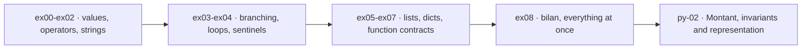

<div align="center">

# learning_tree-ML-systems

**A progressive Python tree toward ML systems, one decision at a time.**

`py-01-basics` → `py-02-advanced`

</div>

---

## About

`learning_tree-ML-systems` is the Python line of a longer plan. The destination
is ML systems, so the work starts where ML systems actually break: how data is
represented, what happens to the rows that do not conform, and whether the
numbers coming out still mean anything.

Each exercise stays small enough to be rebuilt from a blank file. Running is not
the bar. Being able to write it again from nothing is.

Each `py-01-basics` file is executable on its own and ends with the calls that
exercise it, including the inputs that are supposed to fail. The `py-02-advanced`
files define types only, with no driver.

```bash
python3 py-01-basics/ex08/bilan.py
```

## Progress

### py-01-basics

| Exercise | Focus | Status |
|---|---|---|
| [`ex00/types.py`](py-01-basics/ex00/types.py) | conversion, `isinstance`, why `14.0` is not an `int` | **Complete** |
| [`ex01/operateurs.py`](py-01-basics/ex01/operateurs.py) | `//` and `%` on negatives, rounding, fractional exponents | **Complete** |
| [`ex02/chaines.py`](py-01-basics/ex02/chaines.py) | `strip`, `lower`, `split`, the limits of `isdigit` | **Complete** |
| [`ex03/conditions.py`](py-01-basics/ex03/conditions.py) | threshold ladders, truthiness, one reusable validity guard | **Complete** |
| [`ex04/boucles.py`](py-01-basics/ex04/boucles.py) | accumulation, `enumerate`, argmax and its tie rule, sentinel returns | **Complete** |
| [`ex05/listes.py`](py-01-basics/ex05/listes.py) | comprehensions, sorting, the empty list as a real case | **Complete** |
| [`ex06/dictionnaires.py`](py-01-basics/ex06/dictionnaires.py) | grouping, `dict.get` defaults, skipping empty groups | **Complete** |
| [`ex07/fonctions.py`](py-01-basics/ex07/fonctions.py) | default and keyword arguments, bounded filtering | **Complete** |
| [`ex08/bilan.py`](py-01-basics/ex08/bilan.py) | integration: parse, reject, group, aggregate, report | **Complete** |

### py-02-advanced

| Exercise | Focus | Status |
|---|---|---|
| [`ex00/montant.py`](py-02-advanced/ex00/montant.py) | a class that refuses invalid state at construction | **Complete** |
| [`ex01/representation.py`](py-02-advanced/ex01/representation.py) | `__repr__` for debugging, formatting for humans | **Complete** |

## Progression



The basics converge on `bilan`. `bilan` is the point where the pieces stop being
exercises and start being a pipeline with input it cannot trust.

## Decisions worth naming

### Malformed input is counted, not raised

`bilan` reads lines of the form `nom: note`. Real input contains neither only
that form nor only valid notes.

```text
["alice: 14", "", "carol: abc", " Bob : 12 "]
```

Two rejection paths, kept deliberately separate:

* **Malformed.** Wrong field count, empty name, non-numeric note. Counted into
  `ignorees` and returned to the caller. The caller gets to know how much of its
  input was unusable.
* **Filtered.** A well-formed note below `minimum`. Dropped silently, because
  the caller asked for that.

```python
bilan([" Bob : 12 ", "", "carol: abc", "bob: 8"], minimum=10)
# ({'bob': 12.0}, ('bob', 12), 2)
```

Two lines were unusable, so `ignorees` is `2`. `bob: 8` was well formed and
simply below `minimum`, so it left no trace. `" Bob : 12 "` survived whitespace
on both sides of the separator and was folded to the same key as `bob`.

Collapsing these two into one number would hide the difference between bad data
and a narrow query. Aggregates that cannot tell them apart are how a pipeline
reports a clean average over garbage.

### Empty input returns, it does not explode

The same convention across the tree, so callers do not need a special case per
function:

| Function | On empty input |
|---|---|
| `moyenne([])` | `None`, because there is no average to report |
| `min_et_max([])` | `None`, same reason |
| `plus_grande([])` | `-1`, no valid index exists |
| `premiere_vide([...])` | `-1`, nothing matched |
| `bilan([])` | `({}, None, 0)`, shape preserved |

`bilan` keeps its return shape whatever the input. Callers unpack three values
or none, never sometimes.

### Amounts are integers

`Montant` holds centimes as an `int`, never euros as a `float`.

```python
Montant(1499).ajouter(Montant(1)).texte()   # '15,00 €'
```

Floats cannot represent `0.10` exactly, so repeated addition drifts. The
representation is chosen once, at the boundary, and every operation stays in
integers. Conversion to euros happens only on the way out.

The constructor rejects anything that is not a non-negative `int`, so no method
downstream re-checks. An object that exists is an object that is valid.

`ex01` adds the two output paths a value type needs, kept separate on purpose:
`__repr__` for a developer reading a traceback, `texte()` for a human reading a
total.

## What comes next

Toward the layer under model code: tabular data and its schema, columns that
arrive with the wrong type, aggregation that reports its own coverage, and the
point where a representation choice made early decides what the output can mean.
