<div align="center">

# learning_tree-ML-systems

**A progressive Python tree toward ML systems, one decision at a time.**

`py-01-basics` → `py-02-advanced` → `py-03-livrer`

19 of 26 exercises complete

</div>

---

## About

`learning_tree-ML-systems` is the Python line of a longer plan. The destination
is ML systems, so the work starts where ML systems actually break: how data is
represented, what happens to the rows that do not conform, and whether the
numbers coming out still mean anything.

Each exercise stays small enough to be rebuilt from a blank file. Running is not
the bar. Being able to write it again from nothing is.

The three modules ask three different questions:

| Module | Question |
|---|---|
| `py-01-basics` | Can you get a correct answer out of input you do not control? |
| `py-02-advanced` | Can you build a type that makes the wrong answer unrepresentable? |
| `py-03-livrer` | Can someone else install it and run it without asking you how? |

Each `py-01-basics` file is executable on its own and ends with the calls that
exercise it, including the inputs that are supposed to fail. The
`py-02-advanced` files define types only, with no driver: each one restates the
class in full and adds exactly one capability, so any exercise can be read
without the previous eight. `py-03-livrer` turns the result into a command.

```bash
python3 py-01-basics/ex08/bilan.py
python3 py-03-livrer/ex00/releve.py < mesures.txt
```

## Progress

### py-01-basics — complete, 9 of 9

| Exercise | Focus | Status |
|---|---|---|
| [`ex00/types.py`](py-01-basics/ex00/types.py) | conversion, `isinstance`, why `14.0` is not an `int` | **Complete** |
| [`ex01/operateurs.py`](py-01-basics/ex01/operateurs.py) | `//` and `%` on negatives, rounding, fractional exponents | **Complete** |
| [`ex02/chaines.py`](py-01-basics/ex02/chaines.py) | `strip`, `lower`, `split`, the limits of `isdigit` | **Complete** |
| [`ex03/conditions.py`](py-01-basics/ex03/conditions.py) | threshold ladders, truthiness, one reusable validity guard | **Complete** |
| [`ex04/boucles.py`](py-01-basics/ex04/boucles.py) | accumulation, `enumerate`, argmax and its tie rule, sentinel returns | **Complete** |
| [`ex05/listes.py`](py-01-basics/ex05/listes.py) | comprehensions, sorting, the empty list as a real case | **Complete** |
| [`ex06/dictionnaires.py`](py-01-basics/ex06/dictionnaires.py) | grouping, `dict.get` defaults, skipping empty groups | **Complete** |
| [`ex07/fonctions.py`](py-01-basics/ex07/fonctions.py) | default and keyword arguments, bounded filtering | **Complete** |
| [`ex08/bilan.py`](py-01-basics/ex08/bilan.py) | integration: parse, reject, group, aggregate, report | **Complete** |

### py-02-advanced — complete, 9 of 9

One value type, `Montant`, growing one capability per exercise.

| Exercise | Adds | Status |
|---|---|---|
| [`ex00/montant.py`](py-02-advanced/ex00/montant.py) | a class that refuses invalid state at construction | **Complete** |
| [`ex01/representation.py`](py-02-advanced/ex01/representation.py) | `__repr__` for debugging, `texte()` for humans | **Complete** |
| [`ex02/ordre.py`](py-02-advanced/ex02/ordre.py) | `__eq__` and `__lt__`, so `sorted` and `max` work | **Complete** |
| [`ex03/operateurs.py`](py-02-advanced/ex03/operateurs.py) | `__add__`, `__sub__`, `__mul__`, `__rmul__`, and `Ligne` | **Complete** |
| [`ex04/constructeurs.py`](py-02-advanced/ex04/constructeurs.py) | `depuis_euros`, `depuis_texte`: alternative constructors | **Complete** |
| [`ex05/proprietes.py`](py-02-advanced/ex05/proprietes.py) | `euros` and `est_nul` as properties, not methods | **Complete** |
| [`ex06/conteneurs.py`](py-02-advanced/ex06/conteneurs.py) | `Facture` implements `__len__`, `__iter__`, `__getitem__`, `__contains__` | **Complete** |
| [`ex07/heritage.py`](py-02-advanced/ex07/heritage.py) | `LigneRemisee(Ligne)`, and exceptions of its own | **Complete** |
| [`ex08/facture.py`](py-02-advanced/ex08/facture.py) | integration: parse, reject, total, report | **Complete** |

### py-03-livrer — in progress, 1 of 8

Turning the tree into something installable. One exercise per delivery concern.

| Exercise | Focus | Status |
|---|---|---|
| [`ex00/releve.py`](py-03-livrer/ex00/releve.py) | the executable module: importable and runnable, `__main__` guard | **Complete** |
| `ex01` | the command line, `argparse` | To do |
| `ex02` | streams and exit codes | To do |
| `ex03` | the package | To do |
| `ex04` | tests on the rendered output | To do |
| `ex05` | dependencies | To do |
| `ex06` | the manifest | To do |
| `ex07` | the tool, delivered | To do |

## Progression

```mermaid
flowchart LR
    subgraph B["py-01 · correct answers"]
        T["ex00-ex02<br/>values, operators, strings"]
        C["ex03-ex04<br/>branching, loops, sentinels"]
        D["ex05-ex07<br/>lists, dicts, contracts"]
        E["ex08<br/>bilan"]
        T --> C --> D --> E
    end
    subgraph A["py-02 · types that cannot be wrong"]
        M["ex00-ex02<br/>invariants, repr, order"]
        O["ex03-ex05<br/>operators, constructors, properties"]
        K["ex06-ex07<br/>container, inheritance, exceptions"]
        F["ex08<br/>facture"]
        M --> O --> K --> F
    end
    subgraph L["py-03 · deliverable"]
        R["ex00<br/>executable module"]
        S["ex01-ex07<br/>CLI, package, tests, manifest"]
        R --> S
    end
    E --> M
    F --> R
```



Each module converges on an integration exercise, and that exercise is the
handoff to the next module. `bilan` proves the functions compose; `facture`
proves the type holds under a pipeline; `releve` is the first form the result
takes when it has to leave the machine it was written on.

## Decisions worth naming

### Malformed input is counted, not raised

`bilan` reads lines of the form `nom: note`. Real input contains neither only
that form nor only valid notes.

```text
["alice: 14", "", "carol: abc", " Bob : 12 "]
```

Two rejection paths, kept deliberately separate:

* **Malformed.** Wrong field count, empty name, non-numeric note. Counted into
  `ignorees` and returned to the caller. The caller gets to know how much of its
  input was unusable.
* **Filtered.** A well-formed note below `minimum`. Dropped silently, because
  the caller asked for that.

```python
bilan([" Bob : 12 ", "", "carol: abc", "bob: 8"], minimum=10)
# ({'bob': 12.0}, ('bob', 12), 2)
```

Two lines were unusable, so `ignorees` is `2`. `bob: 8` was well formed and
simply below `minimum`, so it left no trace. `" Bob : 12 "` survived whitespace
on both sides of the separator and was folded to the same key as `bob`.

Collapsing these two into one number would hide the difference between bad data
and a narrow query. Aggregates that cannot tell them apart are how a pipeline
reports a clean average over garbage.

### The convention survives the rewrite

`py-02` rebuilds the same idea on top of a type instead of a dict, and keeps the
contract identical:

| | py-01 | py-02 |
|---|---|---|
| Entry point | `bilan(lignes, minimum=0)` | `bilan(lignes, remise=0)` |
| Returns | `(notes, meilleure, ignorees)` | `(total, la_plus_chere, ecartees)` |
| Bad rows | counted into `ignorees` | counted into `ecartees` |

Three values, always, whatever the input. The rejected rows are a number the
caller reads, never an exception it has to guess at. That the convention held
through a full change of representation is the point of the exercise.

### Empty input returns, it does not explode

The same convention across the tree, so callers do not need a special case per
function:

| Function | On empty input |
|---|---|
| `moyenne([])` | `None`, because there is no average to report |
| `min_et_max([])` | `None`, same reason |
| `plus_grande([])` | `-1`, no valid index exists |
| `premiere_vide([...])` | `-1`, nothing matched |
| `bilan([])` | `({}, None, 0)`, shape preserved |

### Amounts are integers, and stay integers

`Montant` holds centimes as an `int`, never euros as a `float`.

```python
Montant(1499) + Montant(1)      # Montant(1500)
Montant(1500).texte()           # '15,00 €'
```

Floats cannot represent `0.10` exactly, so repeated addition drifts. The
representation is chosen once, at the boundary, and every operation stays in
integers. Conversion to euros happens only on the way out, through the `euros`
property added in `ex05`.

The discount in `ex07` is where this is tested for real:

```python
centimes = super().total.centimes * (100 - self.remise) // 100
```

Multiply first, divide last, floor once. Taking a percentage the obvious way,
through a float, would reintroduce at the last step exactly the drift the type
exists to prevent.

The constructor rejects anything that is not a non-negative `int`, so no method
downstream re-checks. An object that exists is an object that is valid.

### Operators return `NotImplemented`, they do not raise

Every comparison and arithmetic dunder checks its operand and returns
`NotImplemented` rather than raising:

```python
def __add__(self, autre):
    if not isinstance(autre, Montant):
        return NotImplemented
    return Montant(self.centimes + autre.centimes)
```

`NotImplemented` tells Python to try the reflected operation on the other
operand before giving up, which is what makes `2 * montant` work through
`__rmul__`. Raising instead would end the dispatch early and break the very
mechanism the exercise is about.

### Exceptions subclass `ValueError`

`ex07` gives the module its own exception types, and derives both from a builtin:

```python
class MontantInvalide(ValueError): pass
class LigneInvalide(ValueError): pass
```

A caller who knows the module catches the precise one. A caller who does not
catches `ValueError` and still works. `ex08` takes the second route on purpose:
one `except ValueError` around the parse counts every kind of bad row into
`ecartees`, without enumerating the failure modes it does not care about.

## What comes next

`py-03-livrer` finishes the line: a command with a real argument parser, streams
and exit codes a shell can branch on, a package another machine installs, and
tests that catch a regression in the rendered output rather than in the
internals.

The point is not packaging for its own sake. Everything downstream in this plan
— a measurement bench, a training script, a grader — is handed to someone else
who installs it and runs it without asking how. `py-03` is where that becomes a
skill instead of an intention.
