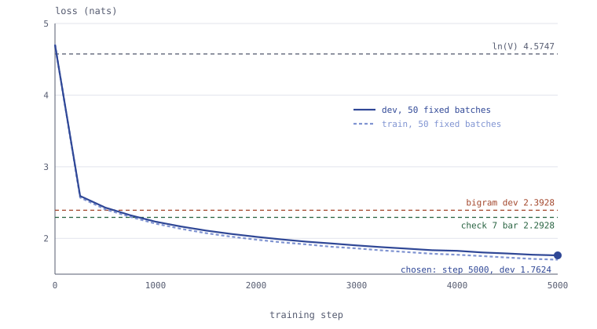

# l1-01-gpt-corpus: a character-level GPT trained on Jules Verne

A causal GPT of 164 065 parameters, attention written by hand, trained on
*Vingt mille lieues sous les mers* in French. It reaches a dev loss of
**1.7480** against a counted bigram at **2.3928**, and a test loss of
**1.6901**, measured once. Everything below can be replayed from this folder.

| | value |
|---|---|
| corpus | Verne, *Vingt mille lieues sous les mers*, Gutenberg #5097, 876 199 characters |
| vocabulary | 97 characters, `ln(V) = 4.5747` |
| dev loss, every window | **1.7480** (1 376 windows of 32) |
| bigram dev loss | 2.3928 |
| test loss, looked at once | **1.6901** (bigram on test: 2.3843) |
| parameters | 164 065 in all, 155 809 without the two embedding tables |
| training | 5 000 steps, 69 s on the CPU of an Apple M4 Pro, torch 2.14.0, Python 3.12.8 |
| checks | 7 of 7 in [`verifier.py`](verifier.py), on this corpus |

## Replay it

```bash
pip install -r requirements.txt     # torch 2.14.0, Python 3.12
python3 prepare.py                  # fetches the source, checks its hash, writes data/verne/
python3 train.py configs/smoke.json # 50 steps, about a second: the pipeline runs
python3 train.py configs/final.json # the published run, writes gpt.pt
python3 evaluate.py                 # dev against ln(V) and the bigram
python3 generate.py                 # the five samples below
python3 plot.py                     # results/curves.svg
python3 verifier.py data/verne      # the seven checks
```

To skip training, download `gpt.pt` from the release
[`l1-01-gpt-corpus-v1`](https://github.com/maximecoia/learning_tree-ML-systems/releases/tag/l1-01-gpt-corpus-v1)
into this folder. Its SHA-256 is
`c60e42be682afd4bb37251b3d21b17486bdb3ec2f9e635beb6c7d1377dc29e7c`. The
weights are never in the git history.

| file | role |
|---|---|
| [`prepare.py`](prepare.py) | raw source to three frozen splits and a manifest, standard library only |
| [`gpt.py`](gpt.py) | the model, nothing else |
| [`train.py`](train.py) | the training loop; reads a config from [`configs/`](configs/) |
| [`evaluate.py`](evaluate.py) | dev on every window; `--test` once, refused a second time |
| [`generate.py`](generate.py) | five samples, seeds 0 to 4, all published |
| [`plot.py`](plot.py) | the two curves, standard library only |
| [`verifier.py`](verifier.py) | the seven checks of the model's invariants |
| [`data/verne/`](data/verne/) | the splits, the vocabulary and [`manifest.json`](data/verne/manifest.json) |
| [`results/`](results/) | losses, run metadata, evaluations, samples, curves |

## The corpus

**Source.** Jules Verne, *Vingt mille lieues sous les mers*, Project Gutenberg
eBook #5097, 942 632 bytes, SHA-256
`53507b025cd3580f4fbfa546baabb36f25adfb48b581c5b5016d91ad69d36c68`, fetched on
2026-10-01. Verne died in 1905 and Gutenberg marks the eBook public domain.
The Gutenberg header and licence are removed, so the published splits carry no
Project Gutenberg trademark. The raw file is not committed: `prepare.py`
fetches it and refuses any other bytes.

**Preparation**, in this order, every step written in `prepare.py` and counted
in the manifest:

| step | characters before → after |
|---|---|
| decode, strict UTF-8 | 942 632 bytes → 918 982 characters |
| `\r\n` and `\r` to `\n` | 918 982 → 900 478 |
| keep only what lies between Gutenberg's START and END lines | 900 478 → 881 106 |
| NFC, invisible characters, trailing spaces | unchanged |
| three blank lines or more to one | 881 106 → 881 096 |
| join the 72-column lines of each paragraph, collapse spaces | 881 096 → 876 403 |
| e-mail addresses and phone numbers | none found |
| drop repeated paragraphs of 64 characters or more | 2 dropped, 196 characters |

The two duplicates are the table-of-contents header and the title, repeated at
the start of the second part. Shorter repeats, 35 of them, are kept: chapter
numbers, the part title, and short lines of dialogue such as
`-- Oui, monsieur.`, nothing a model could recite.

**Split.** Contiguous, 90 / 5 / 5, cut between paragraphs and never inside
one: 788 644, 44 042 and 43 513 characters. Deduplication runs before the
split, so no paragraph sits on both sides. A single continuous text needs no
draw, so the split uses no seed. Test is the last 5 % of the book.

**Representation.** Characters. The vocabulary is the 97 distinct characters
of the three splits, sorted and frozen in `vocab.json`, and the round trip
`decode(encode(x)) == x` is checked on every split before anything is written.
Three runs of `prepare.py`, under Python 3.14.7 and twice under 3.12.8, gave
the same output hashes.

## The model

Three pre-norm blocks of four heads, width 64, context 32, in [`gpt.py`](gpt.py).
The path of one batch of B sequences, shapes on every arrow:

```text
idx                                   (B, 32)        integers in [0, 97)
token_embedding(idx)                  (B, 32, 64)    row idx of a (97, 64) table
+ position_embedding(arange(32))      (32, 64)       broadcast over B
x                                     (B, 32, 64)    the residual stream
3 x block:
    ln1(x)                            (B, 32, 64)
    per head: q, k, v                 (B, 32, 16)    three linears 64 -> 16
              q @ k^T / sqrt(16)      (B, 32, 32)    one score per pair of positions
              masked above diagonal   (B, 32, 32)    -inf where j > i
              softmax over j          (B, 32, 32)    each row sums to 1
              weights @ v             (B, 32, 16)
    concat 4 heads, proj              (B, 32, 64)
    x = x + that                      (B, 32, 64)
    ln2, linear 64 -> 256, GELU       (B, 32, 256)
    linear 256 -> 64                  (B, 32, 64)
    x = x + that                      (B, 32, 64)
ln_f                                  (B, 32, 64)
lm_head                               (B, 32, 97)    the logits
cross-entropy against targets (B, 32), idx shifted by one   -> one number
```

Generation crops the input to the last 32 tokens, keeps the logits of the last
position only, `(B, 97)`, draws from their softmax and appends. Attention is
the only place where positions exchange information; everything else acts on
one position at a time with the same weights.

**Parameters**, counted with `sum(p.numel() for p in model.parameters())`,
which includes both embedding tables, the biases and the LayerNorms:

| part | parameters |
|---|---|
| 3 blocks: attention 16 448, feed-forward 33 088, two LayerNorms 256, each | 149 376 |
| token table, 97 × 64 | 6 208 |
| position table, 32 × 64 | 2 048 |
| final LayerNorm | 128 |
| lm_head, 64 × 97 + 97 | 6 305 |
| **all** | **164 065** |

Without the two embedding tables: 155 809.

## Training

[`configs/final.json`](configs/final.json): 5 000 steps, batches of 32 windows
of 32 characters, AdamW at `lr = 3e-4` with PyTorch's defaults otherwise, seed
1337 for the initialisation and the batches, dropout 0. Every 250 steps, train
and dev are measured on the same 50 fixed batches each, so the curve moves only
when the model does. 69.4 s on the CPU of an Apple M4 Pro.



| step | train | dev |
|---:|---:|---:|
| 0 | 4.7087 | 4.7036 |
| 1 000 | 2.2051 | 2.2331 |
| 2 000 | 1.9827 | 2.0215 |
| 3 000 | 1.8602 | 1.9014 |
| 4 000 | 1.7715 | 1.8255 |
| 5 000 | 1.7023 | 1.7624 |

**Reading it against the landmarks.** The loss starts at 4.70, 0.13 above
`ln(97) = 4.5747`: an honest initialisation whose logits are small but not
zero. Dev crosses the bigram between steps 500 and 750 and keeps falling.

**The step kept, and why.** The last one, 5 000. Dev never rose: it still fell
by 0.009 over the last 250 steps, and the gap between train and dev is 0.06, so
there was no overfitting to stop before. The budget, not the curve, ended the
run: 5 000 steps keep the replay near one minute on a laptop CPU.

The dev number of the table, 1.7624, comes from 50 sampled batches; the 1.7480
of `evaluate.py` is every window of dev. The second one is the published
number, and the one check 7 measures.

## Samples

Five samples of 600 characters from a blank line, seeds 0 to 4, all of them,
in seed order: [`results/samples.txt`](results/samples.txt). The start of seed 0:

```text
ivante, la poys.

-- El, ?

--- S'intonne d'urait un broine se partai-jà, et mais sans en croienses
faxies se cap au ces, pru! Maisonse d' di » Névammanie. Les une celondieur
sem pas. Je reveaux sun de marquare de du la Mansieur sur cham.
```

The model has learned the surface of the book: French spelling and accents,
the `--` of dialogue, guillemets, paragraphs, and the name Conseil, which comes
back in three samples of five. It has not learned words beyond the most
frequent ones, nor syntax. With 32 characters of context, a sentence is already longer
than what the model sees.

## Checks

`python3 verifier.py data/verne`, on these weights:

| check | result |
|---|---|
| 1. `(B,T) -> (B,T,V)`, no loss without targets | (4, 32, 65) |
| 2. loss at init near ln(V) | 4.3338, inside [4.124, 4.924] |
| 3. changing the future leaves the past untouched | drift 0.0 exactly |
| 4. positions reach the model | 0.0010 |
| 5. overfits 32 fixed sequences in 400 steps | 0.0102 |
| 6. `generate` with a context longer than the block | (1, 47) |
| 7. dev below the bigram minus 0.10 | 1.7480 against a bar of 2.2928 |

Checks 1 to 6 build their own models with 65 symbols; check 7 loads `gpt.pt`
and measures it on this corpus.

## What is missing, and what it changes

- **One run, one seed, no search.** The learning rate, the width and the
  context were taken from a reference configuration and never varied. The
  numbers above say what this configuration does, not what this corpus allows.
- **The run was stopped while dev still fell.** A longer run would very likely
  go lower; the curve does not say where it would stop.
- **Test is below dev**, 1.6901 against 1.7480. Both are the end of the book,
  dev the 5 % before test. The last chapters may simply be easier to predict;
  nothing here measures why, and the gap is not taken as a sign of quality.
- **Characters, not subwords.** BPE would let 32 positions cover several
  words instead of a few.
- **Deduplication is exact.** A near-duplicate paragraph, one comma apart,
  would not be caught. On a single novel the risk is small; on a corpus of
  many documents it would matter.
- **CPU only, float32.** Nothing here measures speed on a GPU.
- **A detail found afterwards.** `generate` takes the softmax with `dim=1` on
  a `(B, V)` tensor. It is correct, since the last axis of a 2-D tensor is axis
  1, but `dim=-1` would say what is meant and survive a change of shape.

## Authorship

`gpt.py` is the model I wrote from a blank file, debugged against the seven
checks of `verifier.py` with the help of an AI assistant (Claude). The
training helpers of `train.py`, the preparation, evaluation, sampling and
plotting scripts and this write-up were produced with the same assistant,
then run and checked here. The checks, the numbers and the samples come from
the code in this folder.
